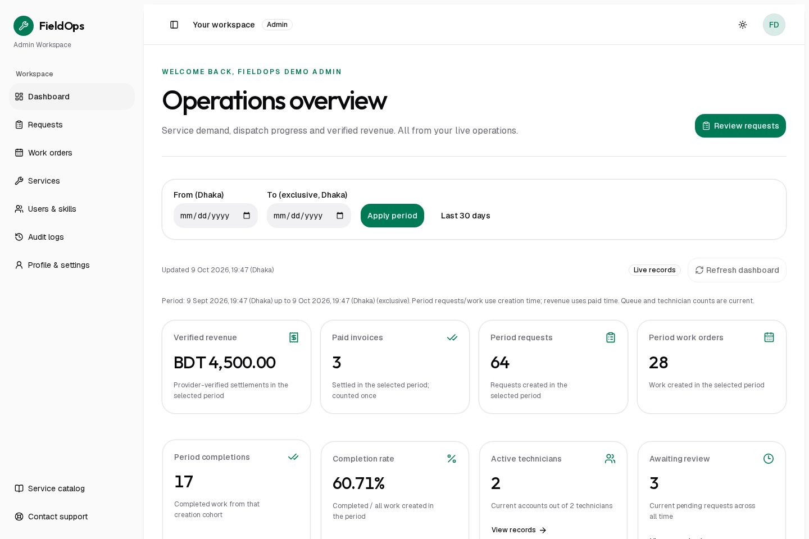
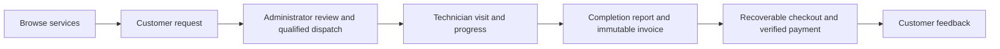

# FieldOps

**Less chasing. More handled.**

FieldOps is a field service management application that connects customers, technicians
and administrators from request to resolution. Customers can follow a visit without
chasing updates; technicians have an assigned-work queue; administrators can coordinate
qualified availability and inspect the operational and financial record.

[Live application](https://fieldops-rafiferdos.vercel.app) ·
[Frontend repository](https://github.com/rafiferdos/fieldops) ·
[Backend repository](https://github.com/rafiferdos/fieldops-api) ·
[Live API](https://fieldops-api-xu3s.onrender.com/api/v1) ·
[API reference](https://github.com/rafiferdos/fieldops-api/blob/main/docs/api-guide.md)

[](https://github.com/rafiferdos/fieldops/actions/workflows/ci.yml)



Administrator workspace captured against dedicated demo accounts. The values are actual
sandbox records at capture time; they change as requests, visits and payments change.

## The problem it solves

Disconnected requests, technician schedules and payment records make service delivery
hard to follow. A customer may not know whether a visit is confirmed, an administrator
may dispatch an unavailable technician, and a changed catalog price can create an invoice
dispute. FieldOps presents one traceable service workflow backed by explicit API rules.

| Need                          | How FieldOps addresses it                                                      |
| ----------------------------- | ------------------------------------------------------------------------------ |
| Clear next steps              | Guided requests, review status, confirmed schedules and work timelines         |
| Safe coordination             | Skill/window availability, ownership checks and conflict-aware dispatch        |
| Accountable service delivery  | Technician progress, completion reports and retained history                   |
| Trustworthy billing           | Frozen invoice amounts, recoverable checkout and server-verified payment state |
| Useful operational visibility | Role-specific dashboards built from actual accessible records                  |
| Controlled administration     | Confirmed access changes, safe skill editing and searchable audit history      |

The application demonstrates these capabilities without claiming unmeasured business
savings, adoption figures or fabricated dashboard trends.

## Explore the product

Public pages explain the workflow and expose the actual service catalog, with search,
sorting, pagination, service details, FAQ and verified contact channels.

| Workspace         | Main capabilities                                                                                                                                      |
| ----------------- | ------------------------------------------------------------------------------------------------------------------------------------------------------ |
| **Customer**      | Live request/visit dashboard; create, edit or cancel eligible owned requests; track work; inspect invoices; recover checkout; submit eligible feedback |
| **Technician**    | Assigned-work dashboard; filtered visit queue; ordered progress; completion report and invoice outcome inspection                                      |
| **Administrator** | Real workload/revenue reporting; review and dispatch; reschedule; catalog, account and skill management; audit browsing                                |

Signing in opens the appropriate dashboard. The public navigation then shows an account
avatar menu with dashboard, profile, settings and confirmed sign-out. The backend currently
provides no profile-photo field, so avatars use the account's initials.

### Demo access and real data

The login page offers configured Customer, Technician and Admin demo buttons. They log in
to dedicated accounts through the **real backend**; they do not switch to a mock dataset.
A normal customer sees their own records, a technician sees assigned visits, and an
administrator sees the permitted global dataset. New accounts legitimately start with
empty dashboards. Retained sandbox verification records may appear in administrator views.

Do not add sensitive information through shared demo accounts. Demo passwords and tokens
are read on the server and are never embedded in client code or repository documentation.
Payments use the real **SSLCommerz sandbox** integration; no live funds are transferred.

## End-to-end workflow



Request/work versions protect eligible mutations. Unknown write outcomes are inspected
before retrying. Checkout recovery retains its original idempotency key; a success-looking
browser URL never marks an invoice paid. The backend remains authoritative for ownership,
access, scheduling, invoice amounts and settlement.

## Technology and engineering

| Responsibility      | Technology and purpose                                                                   |
| ------------------- | ---------------------------------------------------------------------------------------- |
| Application         | Next.js 16 App Router, React 19 and strict TypeScript                                    |
| UI                  | shadcn/ui with Base UI, Tailwind CSS 4, theme tokens and Lucide icons                    |
| Server-state reads  | TanStack Query 5 for per-account hydrated dashboard caching and explicit refresh         |
| Browser transport   | Axios for cancellable, validated same-origin dashboard reads                             |
| Local UI preference | Zustand 5 for the sidebar preference only                                                |
| Forms and contracts | React Hook Form and Zod boundary validation                                              |
| Reporting           | Recharts with shadcn chart primitives, exact money formatting and accessible text counts |
| Motion              | GSAP, responsive scroll choreography and reduced-motion support                          |
| Sessions            | Server-only authenticated encryption and a dedicated Redis store                         |
| Quality             | Vitest, Playwright, axe, typed ESLint, Prettier and GitHub Actions                       |
| Delivery            | Vercel frontend, Render API and Neon PostgreSQL                                          |

The component foundation uses the selected shadcn preset `b2w3Yl9Ygc`. Shared UI primitives
remain the default for controls, cards, sidebars, menus, selects, dialogs and toast feedback.
Geist supports operational reading; Outfit establishes the heading hierarchy.

### Architecture

```text
src/
  app/                    Route compositions and framework boundaries
    (public)/             Marketing, support and real service catalog
    (auth)/               Login and registration
    (workspace)/          Protected dashboards, queues, details and account
    api/workspace/        Authenticated same-origin dashboard read boundary
  features/
    auth/, account/       Identity, session policy and own profile
    workspace/            Live metrics, charts, cache hooks and navigation
    services/, requests/  Catalog and request workflows
    dispatch/             Review, availability and scheduling
    work-orders/          Tracking, progress and completion
    billing/, feedback/   Frozen invoices, checkout recovery and reviews
    admin/                Access, skills, report filters and audit browsing
    marketing/, support/  Public content and verified contact channels
  shared/                 Reusable shadcn UI, presentation and typed helpers
  infrastructure/         API, query, environment, SEO and server session concerns
tests/e2e/                Real-browser workflows and accessibility checks
docs/                     Architecture, design and operational runbooks
```

Server Components own initial reads and route composition. Client boundaries own forms,
menus, chart interaction and motion. Feature schemas, hooks and types live beside their
related behavior; shared/infrastructure code does not depend on features.

The browser calls a narrow, authenticated same-origin dashboard endpoint. Backend Bearer
credentials stay on the server. Query clients are request/provider-owned, keys include
account and role, and returned identity is checked before filling the cache. URL filters
remain shareable; Zustand does not store authentication or backend records. Failed reads
show an error rather than fake zeros; a failed refresh labels the last successful values.

### Security and reliability

- Backend tokens remain in an encrypted server session behind an opaque HttpOnly cookie.
- Redis coordinates refresh rotation across instances; an unavailable session store fails closed.
- Mutations validate their origin and input; backend authorization rechecks current account and ownership.
- Private reads use no-store responses. Public metadata excludes private route indexing.
- Financial amounts use integer minor units or exact decimal-string totals.
- Gateway destinations are restricted; callbacks are inspected through owned backend payment state.
- Version conflicts, revoked access and lost responses have explicit recovery paths.
- Supported shadcn confirmation dialogs protect sign-out and consequential administrative actions.

## Run locally

Prerequisites: Node.js **24.21.0**, npm **11.19.0**, Docker with Compose, and Git.
Use the committed lockfile for reproducible installs.

```bash
git clone https://github.com/rafiferdos/fieldops.git
cd fieldops
nvm use
npm ci
cp .env.example .env.local
docker compose up -d --wait sessions
```

Generate an encryption key once and save its output privately as `SESSION_ENCRYPTION_KEY`:

```bash
node -e "console.log(require('node:crypto').randomBytes(32).toString('base64'))"
```

Set `API_BASE_URL` to `http://localhost:3000/api/v1` for a local
[backend](https://github.com/rafiferdos/fieldops-api#run-locally), or to
`https://fieldops-api-xu3s.onrender.com/api/v1` for the hosted API.
Set `APP_ORIGIN=http://localhost:3001`, then start:

```bash
npm run dev
```

Open [localhost:3001](http://localhost:3001). The API normally uses port 3000.
The frontend session store binds to loopback port **6397**, independently of backend Redis.
`docker compose down` stops it while preserving the volume. Keep the same encryption key
across restarts and instances.

### Environment

Use [.env.example](.env.example) as the complete template.

| Variable                                               | Required behavior                                                                               |
| ------------------------------------------------------ | ----------------------------------------------------------------------------------------------- |
| `API_BASE_URL`                                         | Server-only versioned backend URL ending in `/api/v1`                                           |
| `APP_ORIGIN`                                           | Exact frontend origin, without a path or trailing slash                                         |
| `SESSION_REDIS_URL`                                    | Dedicated session store; authenticated TLS `rediss://` in production                            |
| `SESSION_ENCRYPTION_KEY`                               | Private base64 key containing exactly 32 random bytes                                           |
| `GOOGLE_CLIENT_ID`                                     | Optional public OAuth Web client ID matching the backend audience and authorized browser origin |
| `DEMO_CUSTOMER_*`, `DEMO_TECHNICIAN_*`, `DEMO_ADMIN_*` | Optional private dedicated demo account email/password pairs                                    |

Google uses the same existing Web client ID as the backend; another OAuth client is not
required. Configure exact localhost/production JavaScript origins in Google Cloud. The
provider's supported button handles account selection; the backend verifies its ID token.
When optional Google/demo settings are absent, their controls are omitted.

Never put session keys, demo passwords, tokens or merchant credentials in `NEXT_PUBLIC_*`.
Gateway secrets belong exclusively in backend configuration.

## Quality gates

With Node 24 active:

```bash
npm run check
npm run build
npm run start
```

`check` runs formatting, generated route types, TypeScript, typed linting and Vitest.
The ordinary suite currently has **179 checks**. Six additional real-Redis coordination
checks run against a dedicated local store:

```bash
SESSION_TEST_REDIS_URL=redis://127.0.0.1:6397 npm test
```

CI installs from the lockfile, provisions Redis and runs all checks and the production build.
Actions are pinned by immutable revisions; CI itself does not deploy.

### Browser verification

Run the app and real API, then install Chromium and run read-only/validation scenarios:

```bash
npx playwright install chromium
npm run test:e2e
```

Configured sandbox accounts enable real disposable-record workflows:

```bash
E2E_DEMO_ACCOUNTS=1 E2E_LIVE_WRITES=1 npm run test:e2e
```

Tests cover role dashboards, actual API counts, navigation, logout confirmation, request
ownership, scheduling, progress, completion, frozen invoices, checkout recovery, catalog
changes, account access, skills, audits, responsive behavior and keyboard accessibility.
Write tests create only their own disposable records; completed invoices and audit history
remain. Do not use real customer accounts. Backend authentication limits are respected,
automatic retries are disabled and auth traces/video are not recorded.

Real provider settlement is an additional explicit opt-in:

```bash
E2E_ENV_FILE=.env.payment-test.local E2E_DEMO_ACCOUNTS=1 E2E_LIVE_WRITES=1 E2E_REAL_SANDBOX=1 npm run test:e2e -- tests/e2e/payment-sandbox.spec.ts
```

Use matching isolated sandbox accounts/API and private test configuration. Automated
transport mocks verify boundary behavior; they are not proof of real settlement. Actual
sandbox settlement, IPN, Google login and hosted HTTPS return evidence is recorded
separately in [release verification](docs/hosted-release.md).

## Deployment

The live frontend is hosted on Vercel with Singapore functions and a dedicated Redis
session store. Configure the environment before building, with
`APP_ORIGIN=https://fieldops-rafiferdos.vercel.app`. Keep build-time/runtime origin aligned,
share the session store/key across instances, and configure the matching backend and Google origins.

Deploy only an exact source revision that passed CI, then verify authenticated role flows,
cookies and payment returns on HTTPS. Automatic Git deployments are disabled in
[vercel.json](vercel.json), so release is a deliberate step.
See the [deployment runbook](docs/deployment-runbook.md) for configuration and release checks.

## Design, accessibility and performance

- Responsive shadcn sidebar workspace and token-based light/dark themes.
- Clear typography hierarchy, frosted navigation/workflow surfaces and image-based FAQ cards.
- Early scroll reveals, transform-based choreography and native touch/reduced-motion behavior.
- Keyboard-operated menus, selects, disclosures and dialogs with visible focus and retained focus.
- Text status labels and count summaries; color and chart geometry are supplementary.
- Server-rendered readable content, reserved image geometry and small interactive boundaries.

Automated Chromium/axe checks do not replace testing on actual mobile hardware or Safari.
Free backend hosting can introduce cold-start latency. Current runtime dependencies passed
the last audit; development/build-tool advisory paths still need compatible upstream fixes.
Offline operation, live funds and distributed failover certification are outside the current implementation.

## Further documentation

- [Workspace release and hosted acceptance](docs/workspace-release.md)
- [Dashboard scrolling, animation lifecycle and current release](docs/dashboard-motion.md)
- [Role, route and API map](docs/route-plan.md)
- [Session-safe dashboard and technology decisions](docs/workspace-upgrade.md)
- [Dispatch and execution rules](docs/dispatch-execution-plan.md)
- [Billing and administrative boundaries](docs/billing-admin-plan.md)
- [Access and audit policies](docs/access-audit-plan.md)
- [Payment-return and recovery rules](docs/payment-return-plan.md)
- [Visual system and editorial assets](docs/editorial-assets.md)

## Contributing and ownership

Keep routes small, feature policies explicit and external data validated. Use supported
shadcn primitives and meaningful intent comments. Add tests for changed security, money,
ownership and recovery behavior; keep commits buildable and run the quality gates.

Created and maintained by **MD. Rafi Ferdos**. Product support:
[rafiferdos@gmail.com](mailto:rafiferdos@gmail.com) · [+8801921479294](tel:+8801921479294).
A source-code reuse license has not been specified in this repository.
