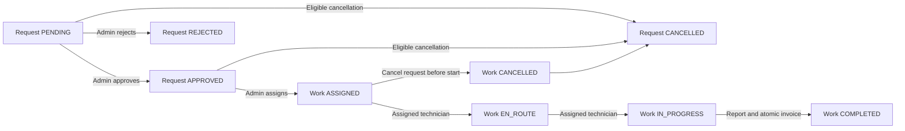

# Screen flows and design handoff

This specification accompanies the [route and API plan](route-plan.md). All screens
below describe the target behavior. See [implementation status](implementation-status.md)
for delivered public browsing, authentication, customer requests, dispatch,
technician execution and customer work tracking. Payment initiation,
feedback submission and reporting remain planned. Browser verification creates
disposable records only when explicitly enabled.

## Visual and interaction foundation

Preserve preset `b2w3Yl9Ygc`: Base UI Rhea, zinc surfaces, emerald theme, Outfit
headings and Geist body. Use semantic theme tokens in both light/dark modes;
status needs text/icon as well as color. Do not introduce a second component system,
custom toast renderer, hardcoded brand palette or decorative dashboard statistics.

Public layout: compact header, readable hero, real catalog preview, process
explanation and useful footer. Workspace layout: role navigation, clear page title,
one primary action and focused content. On mobile use the supported shadcn Sheet
navigation; retain full labels and keyboard access. Lists should adapt into readable
cards or deliberate table overflow without hiding essential actions. Detail pages
use a primary content column and contextual action panel, stacked on small screens.

Use shadcn Button, Card, Input, Label, Select, Badge, Table, Skeleton, Sheet,
Dialog/AlertDialog and supported Toast as actual screens need them. Prefer normal
links for navigation and buttons for actions. Use accessible pagination; label
filters and sort controls. Avoid redundant spacing utilities, nested interactive
elements and icon-only actions without accessible names.

For every fetching route provide a layout-matching skeleton, useful empty state,
recoverable failure, and inaccessible-record state. Distinguish “no records” from
“no matching records”; the latter offers clear filters. Preserve typed values after
validation or transport errors. Async actions expose pending state and prevent
accidental double submission. Announce results accessibly; toasts supplement inline
errors, not replace them. Dialogs require titles, focus containment and focus return.
After navigation or failed form submission, focus must have a sensible destination.
Do not put addresses, credentials or payment billing into query strings.

Server Components read and render data. Client boundaries handle forms, dialogs,
URL controls and interactive charts. Use React Hook Form with Zod when forms begin;
verify its then-current stable compatibility before installation. Add a query cache
only if a demonstrated interactive workflow needs it. Auth tokens, API base URL and
provider credentials never enter browser bundles. Client components use explicit
same-origin actions/handlers, not a general-purpose API proxy.

## Public discovery and account flow

1. Home → Services → Service detail. Render actual catalog data, formatted BDT base
   price and honest service description; do not imply a guaranteed final quotation.
2. Request CTA sends an authenticated CUSTOMER to the wizard with a validated
   service ID. A guest goes through login with a safe return path. Other roles see
   their workspace and an explanation rather than a customer mutation button.
3. Register collects name, email and password using backend limits, with no role
   chooser. Registration success links to login; do not invent a returned session.
4. Login supports password, verified Google and one-click configured demo accounts.
   Return to the authorized destination or the backend account's role landing page.
5. Account shows safe profile fields. Edit only name/phone, with nullable phone
   supported. Role, email and password changes are not profile capabilities.

Session implementation is a separate security checkpoint. Choose a server-owned
session design that keeps tokens secret, coordinates refresh across concurrent
requests/tabs/instances and handles rotation failure. An in-memory per-request lock
alone does not meet that requirement. Backend access tokens last 15 minutes;
refresh tokens are single-use and replay can revoke the session. Use HttpOnly,
production Secure cookies with deliberate SameSite and origin/CSRF protections.
Validate the current account before protected work; clear invalid sessions safely.
Frontend logout must revoke the backend session and clear local session state.
Never log secrets or embed demo passwords in client code or committed documentation.

About/FAQ describe verified behavior. Contact needs real published contact details;
do not invent a support address or a form that claims to send without an endpoint.

## Customer request and tracking

Wizard layout: a visible, accessible step indicator; selected service summary;
Back/Next controls; final submit only on review.

| Step          | Fields and interaction                                                    | Validation                                                                  |
| ------------- | ------------------------------------------------------------------------- | --------------------------------------------------------------------------- |
| Service       | Choose active catalog item; preserve validated service ID from entry link | Existing service UUID; recheck availability before write                    |
| Visit details | Description, address, preferred visit start and explicit timezone         | Description 10–2000, address 10–500; future offset-bearing timestamp        |
| Review        | Read-only summary, base-price explanation and submit                      | Full input schema again at server boundary; no customerId/role/price fields |

Retain draft in component state during navigation; no persistent draft subsystem is
needed initially. Submission success opens the created request. Requests list has
URL-driven filters and a direct route to each record. Request detail shows status,
service, description, address, preferred date and linked work order when assigned.

Only an owner's PENDING request offers edit; editable fields exclude service ID.
Cancellation requires a reason and supported AlertDialog, using the **request**
version. PENDING or APPROVED requests may be cancelled only before work starts;
an ASSIGNED work order is cancelled atomically with its request. Once EN_ROUTE,
do not offer cancellation. Backend still decides eligibility when submitted.

Work list/detail displays assigned technician, schedule, report, latest timeline
events (backend returns at most 100), invoice link and existing feedback. Never
label the timeline as a complete unlimited audit history. Request review status
and work progress appear as separate fields. Paid eligible completion exposes the
one-time feedback form: rating 1–5, optional trimmed comment 1–1000 characters;
omit an empty comment rather than sending a blank string or null. Feedback has no
edit/delete action. Re-read after a duplicate/conflict instead of creating another.

## Admin review and dispatch

Request detail places the review decision above dispatch controls. APPROVE uses the
latest request version; REJECT additionally requires a reason of 3–500 characters.
Only APPROVED, unassigned requests expose assignment.

Dispatch panel: service and customer request context → future visit window →
available qualified technician list → selected technician/window summary → assign.
Availability requires serviceId/start/end and returns paginated safe technician
IDs/names. Changing the window clears the selection and re-queries availability.
Do not treat a selected technician as reserved. Assignment sends technicianId,
start and end, **without a version field**. A scheduling conflict prompts a fresh
availability read and explicit reselection, with entered visit details preserved.

Admin work detail permits reschedule only while ASSIGNED and request APPROVED.
Rescheduling uses the **work-order** version and a fresh availability query; the
price snapshot remains unchanged. ADMIN cannot advance technician progress or
submit a technician completion report. Cancellation from a work context must read
and use the related request version, never the work-order version.

Work progress does not turn the request into a nonexistent COMPLETED request status.

## Technician execution

Queue prioritizes scheduled work using the supported sort, while retaining filters
in the URL. Detail shows only necessary customer/job context and next legal action:
ASSIGNED → EN_ROUTE → IN_PROGRESS → COMPLETED. Do not expose arbitrary status menus,
backward transitions, admin-only schedule changes or invented earnings charts.

Completion form requires a 10–2000 character report and latest work version. Keep
the report after a network failure; inspect current work/invoice before deciding
whether to resubmit. Backend permits an identical completion replay with the
original/current completion version and identical report, returning the same
invoice. A changed report or conflicting state returns 409. Never create an invoice
in a separate frontend request or automatically retry an edited completion.
Technicians see the supported nested invoice summary; direct invoice reads are
for CUSTOMER owner/ADMIN only.

## Invoice, checkout and verified return

Invoice layout: immutable service/price snapshot, BDT amount, paid/unpaid state,
work context and billing panel when eligible. Customer profile must have an E.164
phone; gateway name/email lengths and supported BDT 10–500000 range must be checked
before checkout. Billing address is 5–50, city 2–50, postcode 1–30 characters.
Do not accept a client-supplied amount, owner, currency or paid flag. ADMIN receives
read-only finance context and cannot initiate a customer's checkout.

1. Create one checkout intent with a cryptographically generated 16–100 character
   safe ASCII Idempotency-Key. Retain the key and exact billing input securely with
   the attempt so reloads and uncertain responses can recover the same intent.
   Define retention/session binding during payment implementation; component state
   alone is insufficient for an external gateway round trip.
2. Submit E28 once. First creation may return 201; replay can return 200. Use only a
   validated provider checkout URL; define supported HTTPS gateway hosts for the
   configured environment before implementing external navigation.
3. Timeout/502 may mean UNKNOWN. Keep key/body; after the documented 15-second
   uncertainty window an explicit recovery replays the same intent for reconciliation.
   Do not silently generate another key or initiate a second charge. A 409 active
   attempt needs recovery of that attempt, not an automatic replacement.
4. Read payment and invoice after provider return. Success query parameters, callback
   acknowledgements and a gateway “success” screen do not settle an invoice.
5. Show pending/unknown with bounded rechecks and manual recovery; show review hold
   with clear non-final wording. Enable feedback only after backend-paid invoice
   and no review hold. Never erase a successful settlement because of a late event.

The four current backend callbacks return JSON and do not redirect to the frontend.
M02/M03 are therefore **conditional**, not working return routes. Before that slice,
agree on a real browser-return transport, securely correlate the attempt, and test
success/failure/cancel/late events end to end. Any required backend change needs
separate authorization. Manual navigation back to an invoice is not a claimed
solution to the assignment's real return-flow requirement.

M01 can show a payment only when its ID is known and the backend authorizes it.
Display requiresReview/reviewReason safely; a checkoutUrl is resumable only when
the backend returns it for a PENDING attempt with an unpaid invoice. Do not build
a fabricated payment history or admin reconciliation action without an API.

## Administrative management and reporting

Overview uses backend aggregates and explains the selected period/cohort. Use a
status distribution chart from real counts with a readable text/table equivalent;
do not turn one aggregate into a fake time series. Format revenue strings exactly.
Add a chart package only when this real chart is implemented and compatibility is checked.

Catalog dialogs validate name 2–100, description 10–2000 and integer basePriceMinor
0–1000000000. Confirm deletion using supported AlertDialog and describe soft
deletion accurately. No undelete button or deleted-item filter exists.

User management supports safe role/status changes with explicit confirmation.
Explain session revocation on actual changes; handle the backend's last-active-admin
and technician-active-work guards. Changing access is not user creation.

Skill updates replace the complete service set (up to 100 unique active service
UUIDs; empty set clears). There is **no current-skill read endpoint**, including
admin user responses. Do not prefill an empty set and present it as “current skills”
or implement additive toggles that silently overwrite unknown skills. A usable
prefilled editor requires an independently authorized read contract, or an explicit
full-replacement workflow whose operator supplies the entire intended set. Keep
that editor gated until the approach is resolved; existing qualified technicians
can still be dispatched through the availability endpoint.

Audit inspection exposes only supported filters and stable server pagination.
Render audit values as text; never execute embedded markup. Keep operations and
resource links within the viewer's current role and supported record routes.

## Failure handling and verification gates

| Condition                 | UI behavior                                                                            |
| ------------------------- | -------------------------------------------------------------------------------------- |
| 400                       | Field-level validation where contract permits; retain inputs and show summary          |
| 401                       | Resolve session once through the designed session flow; safe login redirect if expired |
| 403                       | Explain unavailable permission; do not offer an unauthorized retry                     |
| 404                       | Safe missing/unavailable record view without ownership disclosure                      |
| 409                       | Re-read authoritative state/version; explain conflict before explicit resubmission     |
| 429                       | Respect rate-limit guidance when available; no retry loop                              |
| 502 / timeout             | Preserve mutation intent; outcome may be unknown, especially payments                  |
| 503 / unreadable response | Safe unavailable/error state with appropriate read recovery                            |

Never automatically replay writes after refresh or a transport error. Pending
buttons reduce accidents but cannot replace backend concurrency or idempotency.
After confirmed writes refresh the affected detail/list; shared catalog changes
also refresh selectors. Expose only safe backend error messages, never raw proxy
HTML, tokens, stack traces or environment values.

Before each feature commit: formatting, typed lint, typecheck, focused tests and
production build. Add browser tests as interactive features arrive. Essential
acceptance coverage includes:

- Guest/three-role direct navigation, wrong-role actions, foreign-record access,
  logout/revocation, coordinated refresh and safe return URLs.
- Real list URLs, reload/back/forward, empty and failed reads, wizard validation,
  keyboard/dialog focus, small-screen overflow and light/dark readability.
- Stale request/work versions, assignment overlap, state transitions, identical
  completion replay, immutable invoice and protected access changes.
- Stable checkout key/body across uncertainty and reload, verified return,
  duplicate/late callbacks, review holds and paid-only one-time feedback.

Unit tests for schemas/transport do not prove real authorization, gateway behavior
or responsive accessibility. Keep those verification limits explicit. No persistent
mock data, artificial role shortcuts or placeholder product metrics belong in delivery.
